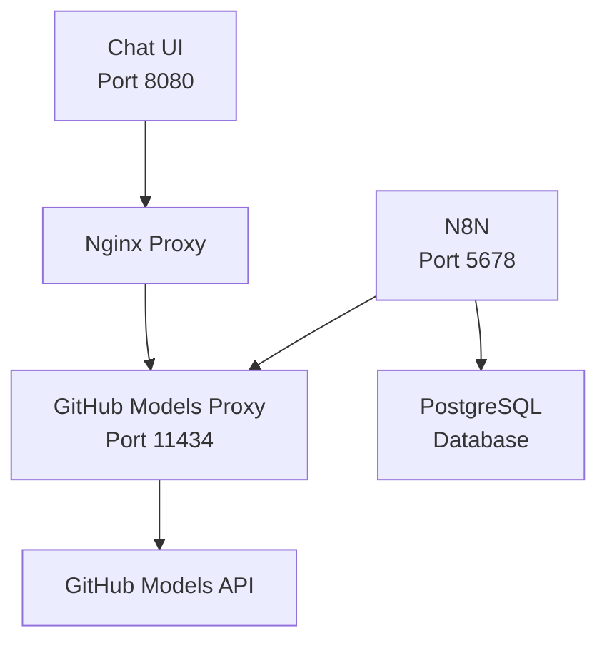

# N8N GitHub Models Proxy

A complete AI integration solution for N8N that provides an OpenAI-compatible API interface to GitHub Models, featuring a modern Claude.ai-inspired chat UI.

## 🌟 Features

### 🔄 GitHub Models Proxy
- **OpenAI-Compatible API**: Drop-in replacement for OpenAI API calls
- **GitHub Models Integration**: Direct access to GitHub's hosted AI models
- **Model Translation**: Automatic mapping between OpenAI and GitHub model names
- **Health Monitoring**: Built-in health checks and error handling

### 💬 Modern Chat UI
- **Claude.ai-Inspired Design**: Beautiful dark theme with smooth animations
- **Real-time Chat**: Interactive chat interface with typing indicators  
- **Responsive Design**: Works perfectly on desktop, tablet, and mobile
- **Keyboard Shortcuts**: Efficient navigation and input handling
- **Code Highlighting**: Syntax highlighting for code blocks with copy functionality
- **Suggested Prompts**: Quick-start prompts for common AI tasks

### 🔧 N8N Integration
- **Seamless Workflow Integration**: Works with existing N8N AI nodes
- **PostgreSQL Database**: Persistent workflow and execution storage
- **Docker Compose Setup**: One-command deployment

## 🚀 Quick Start

### Prerequisites
- Docker and Docker Compose
- GitHub Personal Access Token with Models access
- Git-crypt (for encrypted environment variables)

### Installation

1. **Clone the repository:**
   ```bash
   git clone https://github.com/MarkBovee/N8N.git
   cd N8N
   ```

2. **Unlock encrypted files (if you have the key):**
   ```bash
   git-crypt unlock git-crypt-key
   ```

3. **Start all services:**
   ```bash
   docker-compose up -d
   ```

4. **Access the interfaces:**
   - **Chat UI**: http://localhost:8080
   - **N8N Workflows**: http://localhost:5678 (admin/secret)
   - **API Server**: http://localhost:11434

## 🏗️ Architecture



### Services

| Service | Port | Description |
|---------|------|-------------|
| **Chat UI** | 8080 | Modern web interface for AI chat |
| **GitHub Models Proxy** | 11434 | OpenAI-compatible API server |
| **N8N** | 5678 | Workflow automation platform |
| **PostgreSQL** | 5432 | Database (internal) |

## 🔌 API Usage

### OpenAI-Compatible Endpoints

```javascript
// Chat Completions
POST http://localhost:11434/v1/chat/completions
{
  "model": "gpt-4",
  "messages": [
    {"role": "user", "content": "Hello, world!"}
  ],
  "temperature": 0.7
}

// List Models  
GET http://localhost:11434/v1/models

// Health Check
GET http://localhost:11434/health
```

### Model Mapping

| OpenAI Model | GitHub Model | Description |
|--------------|--------------|-------------|
| `gpt-4o` | `openai/gpt-4.1` | Latest GPT-4 |
| `gpt-4` | `openai/gpt-4.1` | GPT-4 standard |
| `gpt-4o-mini` | `openai/gpt-4.1-mini` | Lightweight GPT-4 |
| `gpt-3.5-turbo` | `openai/gpt-4.1-mini` | Cost-effective option |

## 🎨 Chat UI Features

### Interface Elements
- **Welcome Screen**: Personalized greeting with suggested prompts
- **Chat History**: Persistent conversation with message threading
- **Auto-resize Input**: Text area expands with content
- **Character Counter**: Real-time input length tracking
- **Code Blocks**: Syntax highlighting with one-click copy
- **Typing Indicators**: Visual feedback during AI responses

### Keyboard Shortcuts
- `Enter` - Send message
- `Shift + Enter` - New line in input
- `Ctrl/Cmd + K` - Focus input field
- `Ctrl/Cmd + N` - Start new chat

### Responsive Design
- **Desktop**: Full-width chat with sidebar potential
- **Tablet**: Optimized layout for touch interaction
- **Mobile**: Condensed interface with swipe gestures

## ⚙️ Configuration

### Environment Variables

```bash
# Required
GITHUB_TOKEN=github_pat_your_token_here

# Optional N8N Configuration
N8N_BASIC_AUTH_USER=admin
N8N_BASIC_AUTH_PASSWORD=secret
```

### Docker Compose Services

The `docker-compose.yml` includes:

```yaml
services:
  postgres:          # Database for N8N
  github-models-proxy: # API server
  chat-ui:           # Web interface  
  n8n:              # Workflow platform
```

## 🔒 Security

### Git-Crypt Encryption
- Environment variables encrypted with git-crypt
- GitHub token safely stored in repository
- Key file excluded from version control

### API Security
- CORS headers configured for web interface
- Content Security Policy headers
- No exposed sensitive endpoints

### Access Control
- N8N protected with basic authentication
- Chat UI runs on separate port
- API server validates GitHub tokens

## 🛠️ Development

### Project Structure

```
N8N/
├── web/                    # Chat UI files
│   ├── index.html         # Main interface
│   ├── styles.css         # Dark theme styling  
│   ├── script.js          # Chat functionality
│   ├── nginx.conf         # Proxy configuration
│   └── README.md          # UI documentation
├── openai_api_server.py   # FastAPI proxy server
├── docker-compose.yml     # Multi-service setup
├── Dockerfile            # API server container
├── requirements.txt      # Python dependencies
├── .env                  # Encrypted environment vars
└── .gitcrypt-key        # Encryption key (ignored)
```

### Local Development

1. **API Server**: `python openai_api_server.py`
2. **Chat UI**: Serve `web/` directory with any HTTP server
3. **N8N**: Use Docker or local installation

### Building Images

```bash
# Build API server
docker build -t n8n-github-models-proxy .

# Run individual services
docker-compose up postgres github-models-proxy
```

## 📖 Usage Examples

### N8N Workflow Integration

1. Create new workflow in N8N (http://localhost:5678)
2. Add "HTTP Request" node
3. Configure:
   - **URL**: `http://github-models-proxy:11434/v1/chat/completions`
   - **Method**: POST
   - **Body**: OpenAI-compatible JSON

### Direct API Usage

```python
import requests

response = requests.post('http://localhost:11434/v1/chat/completions', 
  json={
    "model": "gpt-4",
    "messages": [{"role": "user", "content": "Hello!"}]
  }
)

print(response.json())
```

### Chat UI Workflow

1. Open http://localhost:8080
2. Type message or click suggested prompt
3. Receive AI response with formatting
4. Continue conversation or start new chat

## 🚨 Troubleshooting

### Common Issues

**Chat UI not loading:**
```bash
docker-compose logs chat-ui
# Check nginx configuration and port conflicts
```

**API server errors:**
```bash
docker-compose logs github-models-proxy  
# Verify GITHUB_TOKEN is valid and has Models access
```

**N8N connection issues:**
```bash
docker-compose logs n8n postgres
# Check database connection and initialization
```

### Health Checks

- **API Health**: `curl http://localhost:11434/health`
- **Chat UI**: Open http://localhost:8080
- **Container Status**: `docker-compose ps`

## 🔄 Updates

### Updating the Proxy
1. Modify `openai_api_server.py`  
2. Rebuild: `docker-compose up --build github-models-proxy`

### Updating Chat UI
1. Modify files in `web/` directory
2. Restart: `docker-compose restart chat-ui`

## 🤝 Contributing

1. Fork the repository
2. Create feature branch: `git checkout -b feature/amazing-feature`
3. Commit changes: `git commit -m 'Add amazing feature'`
4. Push branch: `git push origin feature/amazing-feature`
5. Open Pull Request

## 📄 License

This project is licensed under the MIT License - see the LICENSE file for details.

## 🙏 Acknowledgments

- **GitHub Models** for providing hosted AI model access
- **N8N** for the excellent workflow automation platform
- **Claude.ai** for UI/UX design inspiration
- **FastAPI** for the robust API framework

---

**Made with ❤️ by MarkBovee** | [GitHub](https://github.com/MarkBovee/N8N)